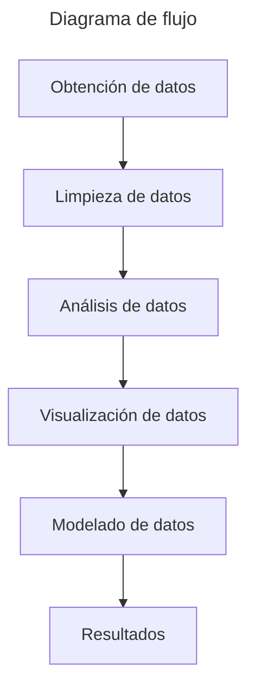

# Desarrollo del proyecto de tesis

### Organización del repositorio

En este repo se encuentran mayoría de los datos utilizados para los respectivos análisis, los que no se encuentran se
mencionarán en un archivo independiente y se explicará como obtenerlos, ya que el peso es excesivo para subirlo a GitHub.

#### Datos
La carpeta `datos` contiene los datos utilizados para los análisis, estos son:
- `parcelas`
Se divide en multiples carpetas, cada una contiene los datos para cada una de las parcelas, la carpeta principal es
  [parcelas](https://github.com/VivaldoGP/Tesis/tree/main/datos/parcelas), la distribución y contenido son:
  - `indices_stats` contiene los datos de los índices de vegetación calculados para cada una de las parcelas. Es importante
  aclarar que en este punto los datos no están revisados ni han sido filtrados, por lo que se encuentran en su versión 'cruda'.
  - ``indices_stats_cleaned`` contiene los datos de los índices de vegetación calculados para cada una de las parcelas,
  para este punto las fechas que presentan datos inconsistentes han sido ignoradas, se delimitaron al rango de fechas
  correctas y se eliminaron los datos que no cumplen con los criterios de calidad. Se podría decir que estos datos son
  una versión lista para unirse con los datos agrometerológicos.
  - ``evapotranspiration`` contiene los datos de la evapotranspiración de cada una de las parcelas, estos datos tienen
  una resolución temporal de 1 día, y corresponden al periodo de fechas con el que fueron descargados originalmente,
  se considera como la versión cruda de los datos. Su adquisición fue posible con el script 
  [agera5_data.py](https://github.com/VivaldoGP/Tesis/blob/main/scripts/agera5_data.py).
  - ``evapotranspiration_harvest_dates`` contiene los datos de la evapotranspiración de cada una de las parcelas, la
  resolución temporal es la misma que la versión cruda, pero se delimitaron al rango de fechas correctas para cada parcela.
  - ``precipitation`` es el caso idéntico al de la evapotranspiración, pero con los datos de precipitación.
  - ``precipitation_harvest_dates`` es el caso idéntico al de la evapotranspiración, pero con los datos de precipitación
  delimitados al rango de fechas correctas para cada parcela.
  - ``temperature`` es el caso idéntico al de la evapotranspiración, pero con los datos de temperatura.
  - ``temperature_harvest_dates`` es el caso idéntico al de la evapotranspiración, pero con los datos de temperatura
  delimitados al rango de fechas correctas para cada parcela.
  - ``merged`` los datos de los índices espectrales se unen con los de evapotranspiración de acuerdo a la coincidencia
  en las fechas, se obtiene un solo archivo con los datos de los índices espectrales y la evapotranspiración para
    cada una de las parcelas.
  - ``kc`` contiene los datos de coeficiente de cultivo para cada una de las parcelas, estos datos se obtuvieron a partir
  de la carpeta merged.
  - ``ready_to_analyze`` contiene los datos presentes en la carpeta kc pero con el conteo de los días transcurridos desde
  la primera fecha de la serie temporal, esto con el fin de facilitar el análisis de los datos.

La carpeta ``data_analysis`` contiene: [data_analysis](https://github.com/VivaldoGP/Tesis/tree/main/data_analysis)
  - ``datos`` carpeta en la que se encuentran los resultados de los primeros análisis:
    - ``model_predicts`` contiene los datos resultantes de los modelos de regresión polinomial en sus diferentes grados
    y los valores 'reales' ya presentes en la carpeta ``ready_to_analyze``.
    - [finde_degree.py](https://github.com/VivaldoGP/Tesis/blob/main/data_analysis/find_degree.py) es el script que se 
    encarga de encontrar el grado del polinomio que mejor se ajusta a los datos y guarda los valores en la carpeta
    anterior.

La carpeta ``fechas_clave`` contiene:
  - [clouds.json](https://github.com/VivaldoGP/Tesis/blob/main/fechas_claves/clouds.json) para cada parcela se especifica
  la fecha que se considera que presenta una nube en la escena o que presenta una anomalia desconocida.
  - [harvest.json](https://github.com/VivaldoGP/Tesis/blob/main/fechas_claves/harvest.json) para cada parcela se 
  especifica la fecha de cosecha.

La carpeta ``Parcelas`` contiene la información espacial de las parcelas de estudio, su ubicación en distintos formatos,
sus geometrías y los datos necesarios en formato vectorial apto para SIG y un formato más apto para el uso en Python.
[Parcelas](https://github.com/VivaldoGP/Tesis/tree/main/Parcelas)
- ``centroides`` como su nombre lo dice, son los centroides de cada uno de los polígonos de las parcelas.
- ``poligonos_parcelas`` son los polígonos de las parcelas.
- [poligonos_parcelas.geojson](https://github.com/VivaldoGP/Tesis/blob/main/Parcelas/poligonos_parcelas.geojson) es el 
formato amigable para su apertura en Python y otros lenguajes de programación.

#### Código

La carpeta `scripts` contiene los scripts utilizados para la adquisición de datos, limpieza, análisis y visualización
de los datos, es la carpeta más importante del repositorio, ya que contiene los scripts que permiten que los procesos
se puedan replicar junto a los datos base. [scripts](https://github.com/VivaldoGP/Tesis/tree/main/scripts). Dentro de la
carpeta se encuentra la descripción de cada uno de los scripts y su funcionamiento o directamente desde 
[aquí](https://github.com/VivaldoGP/Tesis/blob/main/scripts/README.md).

Después de ver los scripts principales y su secuencia de ejecución, es importante mencionar las utilidades desarrolladas
para su implementación en los scripts con el fin de hacer más legible el código y facilitar la reutilización de código.
Estas utilidades son:
- [vector_utils](https://github.com/VivaldoGP/Tesis/tree/main/vector_utils): la finalidad es el desarrollo de utilidades
para el manejo de datos vectoriales, en especial las geometrías de las parcelas, su uso es principalmente en la creación
datos en memoria para emplearlos en los scripts sin necesidad de guardarlos en memoria, el ejemplo más claro es la
creación del buffer virtual.
- [some_utils](https://github.com/VivaldoGP/Tesis/tree/main/some_utils): incluye utilidades como funciones que se implementan
en los scripts, limpieza de datos, ordenamiento, etc.
- [raster_utils](https://github.com/VivaldoGP/Tesis/tree/main/raster_utils): incluye funciones que leen y generan
información del tipo raster, como la generación de índices espectrales, la lectura de archivos .tif, etc.
- [test](https://github.com/VivaldoGP/Tesis/tree/main/test): antes de ejecutar los scripts y guardar los datos en memoria
se realizan pruebas que se llevan a cabo con el sistema de test de python, en esta carpeta se encuentran los test de:
  - ``test_cleanning.py`` pruebas para la limpieza de datos.
  - ``test_plotting.py`` pruebas para la visualización de datos.
  - ``test_polys.py`` pruebas para el cálculo de modelos polinómicos para modelar los datos.