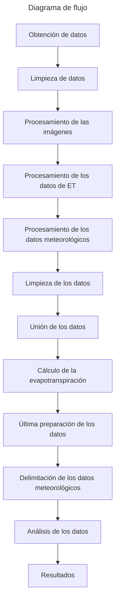

# Cómo replicar los procedimientos

En esta carpeta llamada **scripts** se encuentran cada uno de los programas que llevan a cabo las tareas específicas y 
funciones necesarias para los pasos posteriores.

# Adquisición de las imágenes

El primer paso es adquirir las imágenes que se van a utilizar en el análisis, para esto se desarrolló el script
[ee_fetch_data.py](https://github.com/VivaldoGP/Tesis/blob/main/scripts/ee_fecth_images.py), 
que se conecta a los datasets de [Google Earth Engine](https://earthengine.google.com/), filtra las imágenes cuya geometría logra intersectar 
con la geometría de las parcelas de estudio, por medio de los parámetros establecidos descarta las imágenes que 
presentan nubes en la escena y descarga imágenes recortadas a la extensión máxima de cada una de las parcelas.

## Adquisición de los datos de Evapotranspiración

El script [agera5_data.py](https://github.com/VivaldoGP/Tesis/blob/main/scripts/agera5_data.py) descarga los rasters en
el rango de fechas establecido, la URL es la proporcionada por el 
programa copernicus en el siguiente [link](https://data.apps.fao.org/static/data/index.html?prefix=static%2Fdata%2Fc3s%2FAGERA5_ET0).

## Ordenamiento y estructuración de los datos

Las imágenes que se descargaron fueron almacenadas en una sola carpeta, para esto se desarrolló un script simple que 
ordena las imágenes en una estructura de carpetas en las que cada carpeta representa una parcela y dentro se encuentran 
imágenes exclusivamente de la zona de estudio de esa parcela.
El script es [move_files](https://github.com/VivaldoGP/Tesis/blob/main/scripts/move_files.py).

## Procesamiento de las imágenes

Hasta este punto se tienen imágenes con un nivel de procesamiento 2A, dentro de cada archivo raster se encuentran las 
bandas necesarias para realizar los análisis que se consideren necesarios, se desarrollaron utilidades y scripts para 
obtener los datos deseados, que en este caso son los valores estadísticos de los índices espectrales para cada parcela, 
con una especial consideración, se toma la geometría de cada parcela y se realiza un buffer interno de 5 metros para 
asegurar que los datos obtenidos correspondan al interior de la parcela y no a los bordes, a continuación se listan 
las utilidades y scripts con su respectiva función:

- [geopro_tools.py](https://github.com/VivaldoGP/Tesis/blob/main/vector_utils/geopro_tools.py) realiza el buffer de la
geometría y lo almacena en memoria para no tener que guardarlo en el disco, lo cual hace el proceso más dinámico y flexible.
- [spectral_indices.py](https://github.com/VivaldoGP/Tesis/blob/main/raster_utils/spectral_indices.py) calcula los 
índices espectrales.
- [process_data.py](https://github.com/VivaldoGP/Tesis/blob/main/scripts/process_data.py) calcula las estadísticas de
cada índice y exporta los valores a un documento tipo csv, esto para la parcela especificada.

## Procesamiento de los datos de ET

Para cada parcela se genera su centroide y se extrae el valor del pixel que intersecta con el punto del centroide, 
se exporta un csv para cada parcela y se obtienen los datos para cada imagen y se almacenan, el script que realiza 
esta tarea es [process_et_data.py](https://github.com/VivaldoGP/Tesis/blob/main/scripts/process_et_data.py).
 

## Procesamiento de los datos meteorológicos
Se realiza el mismo procedimiento, pero con los otros datos, las variables son:
- Temperature_Air_2m_Mean_24h
- Solar_Radiation_Flux
- Relative_Humidity_2m_12h
- Precipitation_Flux

El script que realiza esta tarea es [process_prep_data.py](https://github.com/VivaldoGP/Tesis/blob/main/scripts/process_prep_data.py),
la diferencia con el anterior es que los datos de entrada se encuentran en formato NetCDF, por lo que se utiliza la 
librería xarray para realizar la extracción de los datos y se exportan a un archivo csv. Por esa razón se tienen dos 
scripts distintos que tienen la misma finalidad.

## Limpieza de los datos

Hasta este momento ya tenemos las imágenes y sus datos listos para comenzar a realizar los diferentes análisis deseados
pero es fundamental asegurar que los datos actuales con los que se cuentan sean útiles o válidos, para esto se deberá 
'limpiar' la información con la intención de no incluir en los análisis datos que correspondan a imágenes con presencia 
de nubes, ya que el primer filtro solo es capaz de descartar las imágenes que en su máscara de nubes identificaban 
píxeles con esta descripción, en algunos casos este primer filtro no es suficiente y es necesario hacer una depuración. 
Una primera forma de realizar esta tarea es graficar una serie de tiempo con los datos que ya se tienen y ver el 
comportamiento de estos, buscando anomalías y posteriormente corroborar individualmente si esos valores que a primera 
vista son anómalos son en realidad por la presencia de una nube o alguna otra causa es la razón de la anomalía., 
con esto se puede proceder a generar un archivo que contenga las imágenes que presentan nubes y sus respectivas fechas, 
esto para cada parcela, así se podrán descartar al momento de realizar los análisis posteriores.
El script que realiza esta tarea es [prepare_data.py](https://github.com/VivaldoGP/Tesis/blob/main/scripts/prepare_data.py),
el cual está estructurado de la siguiente manera:

## Unión de los datos

Una vez que tienen los datos limpios y se cuenta con los valores de la evapotranspiración se procede a realizar la unión
de ambos conjuntos de datos, para esto se desarrolló el script [merge_data.py](https://github.com/VivaldoGP/Tesis/blob/main/scripts/merge_data.py), 
el cual realiza la unión de los datos mediante la columna **fecha**, la cual es común en ambos conjuntos de datos, 
el resultado es un archivo csv con los datos de cada parcela y su respectiva evapotranspiración para cada fecha.

## Cálculo de la evapotranspiración

Para calcular la evapotranspiración del cultivo se tomó como base la evapotranspiración de referencia obtenida del 
dataset agERA5, tomando el promedio del **ndvi** de cada parcela y multiplicando por los factores correspondientes se obtuvo
el coeficiente de cultivo y se multiplicó por la evapotranspiración de referencia para obtener la evapotranspiración del cultivo.
El script encargado de realizar esta tarea es [kc_et.py](https://github.com/VivaldoGP/Tesis/blob/main/scripts/kc_et.py).

## Última preparación de los datos

Se tienen las diferentes variables para cada una parcela respecto a cada fecha, pero es necesario conocer los días
transcurridos a partir de la primera fecha, para esto se desarrolló el script [counting_days.py](https://github.com/VivaldoGP/Tesis/blob/main/scripts/counting_days.py), el cual realiza esta
tarea y exporta un nuevo archivo csv a la carpeta [ready_to_analyze](https://github.com/VivaldoGP/Tesis/tree/main/datos/parcelas/ready_to_analyze), la cual está dividida por zafras.

## Delimitación de los datos meteorológicos

Una vez que se tienen los datos meteorológicos se procede a delimitar el rango de fechas que se utilizarán para el análisis, en este 
caso las fechas establecidas en el archivo [harvest.json](), el script que realiza esta tarea es [climate_process.py]() y su función
es 'recortar' el dataframe a las fechas establecidas en el archivo mencionado.

# Diagrama de flujo

